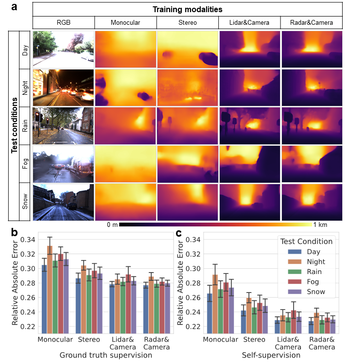
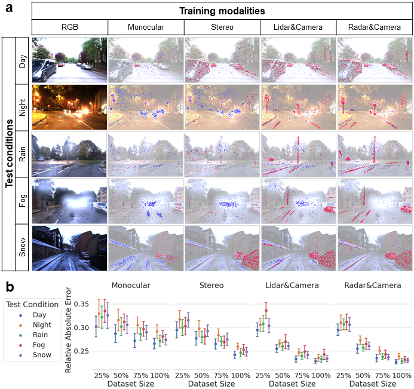

# Towards All-Weather Autonomous Driving

### [Paper](https://arxiv.org/abs/) | [Pretrained Models](https://drive.google.com/drive/folders/1o1skoCknnlBe-OkVlCEEi3kQPKdBIAS-?usp=sharing)
<br>

<br>

In this work, we propose deep learning-based GRAMME generalizable to diverse settings such as day, night, rain, fog, and snow. GRAMME is a geometry-Aware, multi-modal, modular, interpretable, and self-supervised ego-motion estimation system.

GRAMME involves the following architectures:

- Self-supervised monocular depth and ego-motion
- Self-supervised stereo depth and ego-motion
- Self-supervised lidar ego-motion
- Self-supervised radar ego-motion
- Self-supervised depth and ego-motion from camera and lidar
- Self-supervised depth and ego-motion from camera and radar

Overview of the GRAMME conceptual framework and architecture:
<br>

<br>

## Example Results

### Generalization to adverse conditions and depth prediction performance.


### Generalization to adverse conditions and depth prediction performance.



## Computational Hardware and Software
The experiments are conducted on an Ubuntu 20.04 LTS computer with Intel Xeon CPUs and NVIDIA RTX 3090 GPUs accelerated by CuDNN, using Python 3.8.

### Getting started

- Clone this repo:
```bash
git clone https://github.com/yasinalm/gramme
cd gramme
```

### Prerequisites

<!-- We recommend using a [conda environment](https://conda.io/docs/user-guide/tasks/manage-environments.html) to avoid dependency conflicts. -->
We recommend creating a virtual environment with Python 3.8 `conda create -n gramme python=3.8 anaconda`.
Using a fresh [Anaconda](https://www.anaconda.com/download/) distribution, you can install the dependencies with:
```shell
conda install pytorch=1.8.2 torchvision=0.9.1 cudatoolkit=10.2 -c pytorch
conda install -c conda-forge tensorboardx=2.4
pip install --user colour-demosaicing # needed to process datasets
```

You can install the remaining dependencies as follow:
```shell
conda install --file requirements.txt
```

## Datasets
GRAMME currently supports the following datasets and the sensors. To easily make use of our preprocessing codes, keep the directory structure the same as the original datasets.  Please follow their licencing regulations for the datasets.
- [Oxford Robotcar](https://robotcar-dataset.robots.ox.ac.uk/) dataset 
  - Bumblebee XB3 stereo camera (main data source for the experiments in the paper)
  - Grasshopper2 monocular camera
  - SICK LD-MRS 3D LIDAR
  - NovAtel SPAN-CPT ALIGN inertial and GPS navigation system
- [Oxford Radar Robotcar](https://oxford-robotics-institute.github.io/radar-robotcar-dataset/) dataset
  - Bumblebee XB3
  - Grasshopper2
  - NovAtel SPAN-CPT ALIGN inertial and GPS navigation system
  - Navtech CTS350-X radar
  - Velodyne HDL-32E lidar
- [RADIATE](http://pro.hw.ac.uk/radiate/) dataset.
  - ZED stereo camera
  - Velodyne HDL-32E lidar
  - Navtech CTS350-X radar
  - Advanced Navigation Spatial Dual GPS/IMU

To test our provided pre-trained models, you can download the small-size sample sequences.

In addition, you can quickly adopt GRAMME to custom datasets by extending the data loader classes located in the `./datasets/` folder.

### Preprocessing
Although GRAMME supports on-the-fly processing of the input files, we recommend offline processing of the input datasets using the provided scripts. The scripts will process the datasets and save the processed files to disk. The preprocessing includes colour-demosaicing of the Bayer images and rectification. We also optionally crop the bottom part of the Robotcar images occluded by the bonnet. You can use the following script for preprocessing:

For the Robotcar dataset:
```shell
cd preprocess/
python undistort_robotcar.py /path/to/robotcardataset/
```

For the RADIATE dataset:
```shell
cd preprocess/
python rectify_radiate.py /path/to/radiatedataset/
```

The scripts will create a sub-directory in the dataset folder named `stereo_undistorted` and save the processed files to the directory. You can notify the training and inference codes passing the `pretrained` flag. See the documentation of the codes for more details.

## Experiments
You can use the following commands to train and test the models.

### Training
After the download and the preprocessing, you can run the following commands. For ease of use, we created individual files to train/test the desired modalities.

**Radar-based experiments**
To train a radar-based model including the camera, run the following command:
```shell
python train.py /path/to/dataset/ --dataset dataset_name --name experiment_name
```

The code can be configured with the following arguments:

```bash
usage: train.py [-h] [--sequence-length N] [--skip-frames N] [-j N]
                [--epochs N] [--train-size N] [--val-size N] [-b N] [--lr LR]
                [--momentum M] [--beta M] [--weight-decay W] [--print-freq N]
                [--ckpt-freq N] [--seed SEED] [--log-summary PATH]
                [--log-full PATH] [--log-output LOG_OUTPUT]
                [--resnet-layers {18,50}] [--num-scales W] [--img-height W]
                [--img-width W] [-p W] [-f W] [-s W] [-c W]
                [--with-ssim WITH_SSIM] [--with-mask WITH_MASK]
                [--with-auto-mask WITH_AUTO_MASK] [--with-masknet]
                [--masknet {convnet,resnet}] [--with-vo]
                [--cam-mode {mono,stereo}] [--pretrained-disp PATH]
                [--pretrained-vo-pose PATH] [--with-pretrain]
                [--dataset {hand,robotcar,radiate,cadcd}]
                [--with-preprocessed WITH_PREPROCESSED]
                [--pretrained-mask PATH] [--pretrained-pose PATH]
                [--pretrained-fusenet PATH] [--pretrained-optim PATH] --name
                NAME [--padding-mode {zeros,border}] [--gt-file DIR]
                [--radar-format {cartesian,polar}] [--range-res W]
                [--angle-res W] [--cart-res W] [--cart-pixels W]
                DIR

Unsupervised Geometry-Aware Ego-motion Estimation for radars and cameras.

positional arguments:
  DIR                   path to dataset

optional arguments:
  -h, --help            show this help message and exit
  --sequence-length N   sequence length for training (default: 3)
  --skip-frames N       gap between frames (default: 1)
  -j N, --workers N     number of data loading workers (default: 4)
  --epochs N            number of total epochs to run (default: 200)
  --train-size N        manual epoch size (will match dataset size if not
                        set) (default: 0)
  --val-size N          manual validation size (will match dataset size if
                        not set) (default: 0)
  -b N, --batch-size N  mini-batch size (default: 4)
  --lr LR, --learning-rate LR
                        initial learning rate (default: 0.0001)
  --momentum M          momentum for sgd, alpha parameter for adam (default:
                        0.9)
  --beta M              beta parameters for adam (default: 0.999)
  --weight-decay W, --wd W
                        weight decay (default: 0)
  --print-freq N        print frequency (default: 10)
  --ckpt-freq N         checkpoint saving frequency in terms of epochs
                        (default: 1)
  --seed SEED           seed for random functions, and network initialization
                        (default: 0)
  --log-summary PATH    csv where to save per-epoch train and valid stats
                        (default: progress_log_summary.csv)
  --log-full PATH       csv where to save per-gradient descent train stats
                        (default: progress_log_full.csv)
  --log-output LOG_OUTPUT
                        will log dispnet outputs at validation step (default:
                        1)
  --resnet-layers {18,50}
                        number of ResNet layers for depth estimation.
                        (default: 18)
  --num-scales W, --number-of-scales W
                        the number of scales (default: 1)
  --img-height W        resized mono image height (default: 192)
  --img-width W         resized mono image width (default: 320)
  -p W, --photo-loss-weight W
                        weight for photometric loss (default: 1)
  -f W, --fft-loss-weight W
                        weight for FFT loss (default: 0.0003)
  -s W, --ssim-loss-weight W
                        weight for SSIM loss (default: 1)
  -c W, --geometry-consistency-weight W
                        weight for depth consistency loss (default: 1.0)
  --with-ssim WITH_SSIM
                        with ssim or not (default: 1)
  --with-mask WITH_MASK
                        with the mask for moving objects and occlusions or
                        not (default: 1)
  --with-auto-mask WITH_AUTO_MASK
                        with the mask for stationary points (default: 1)
  --with-masknet        with the masknet for multipath and noise (default:
                        False)
  --masknet {convnet,resnet}
                        MaskNet type (default: convnet)
  --with-vo             with VO fusion (default: False)
  --cam-mode {mono,stereo}
                        the dataset to train (default: stereo)
  --pretrained-disp PATH
                        path to pre-trained DispResNet model (default: None)
  --pretrained-vo-pose PATH
                        path to pre-trained VO Pose net model (default: None)
  --with-pretrain       with or without imagenet pretrain for resnet
                        (default: False)
  --dataset {hand,robotcar,radiate,cadcd}
                        the dataset to train (default: hand)
  --with-preprocessed WITH_PREPROCESSED
                        use the preprocessed undistorted images (default: 1)
  --pretrained-mask PATH
                        path to pre-trained masknet model (default: None)
  --pretrained-pose PATH
                        path to pre-trained Pose net model (default: None)
  --pretrained-fusenet PATH
                        path to pre-trained PoseFusionNet model (default:
                        None)
  --pretrained-optim PATH
                        path to pre-trained optimizer state (default: None)
  --name NAME           name of the experiment, checkpoints are stored in
                        checpoints/name (default: None)
  --padding-mode {zeros,border}
                        padding mode for image warping (default: zeros)
  --gt-file DIR         path to ground truth validation file (default: None)
  --radar-format {cartesian,polar}
                        Range-angle format (default: polar)
  --range-res W         Range resolution of FMCW radar in meters (default:
                        0.0432)
  --angle-res W         Angular azimuth resolution of FMCW radar in radians
                        (default: 0.015708)
  --cart-res W          Cartesian resolution of FMCW radar in meters/pixel
                        (default: 0.25)
  --cart-pixels W       Cartesian size in pixels (used for both height and
                        width) (default: 512)
```

**Lidar-based experiments**
To train a lidar-based model including the camera, run the following command:
```shell
python train_lidar.py /path/to/dataset/ --dataset dataset_name --name experiment_name
```

The code can be configured with the following arguments:

```bash
usage: train_lidar.py [-h] [--sequence-length N] [--skip-frames N] [-j N]
                      [--epochs N] [--train-size N] [--val-size N] [-b N]
                      [--lr LR] [--momentum M] [--beta M] [--weight-decay W]
                      [--print-freq N] [--ckpt-freq N] [--seed SEED]
                      [--log-summary PATH] [--log-full PATH]
                      [--log-output LOG_OUTPUT] [--resnet-layers {18,50}]
                      [--num-scales W] [--img-height W] [--img-width W]
                      [-p W] [-f W] [-s W] [-c W] [--with-ssim WITH_SSIM]
                      [--with-mask WITH_MASK]
                      [--with-auto-mask WITH_AUTO_MASK] [--with-masknet]
                      [--masknet {convnet,resnet}] [--with-vo]
                      [--cam-mode {mono,stereo}] [--pretrained-disp PATH]
                      [--pretrained-vo-pose PATH] [--with-pretrain]
                      [--dataset {hand,robotcar,radiate}]
                      [--with-preprocessed WITH_PREPROCESSED]
                      [--pretrained-mask PATH] [--pretrained-pose PATH]
                      [--pretrained-fusenet PATH] [--pretrained-optim PATH]
                      --name NAME [--padding-mode {zeros,border}]
                      [--gt-file DIR] [--cart-res W] [--cart-pixels W]
                      DIR

Unsupervised Geometry-Aware Ego-motion Estimation for LIDARs and cameras.

positional arguments:
  DIR                   path to dataset

optional arguments:
  -h, --help            show this help message and exit
  --sequence-length N   sequence length for training (default: 3)
  --skip-frames N       gap between frames (default: 1)
  -j N, --workers N     number of data loading workers (default: 4)
  --epochs N            number of total epochs to run (default: 200)
  --train-size N        manual epoch size (will match dataset size if not
                        set) (default: 0)
  --val-size N          manual validation size (will match dataset size if
                        not set) (default: 0)
  -b N, --batch-size N  mini-batch size (default: 4)
  --lr LR, --learning-rate LR
                        initial learning rate (default: 0.0001)
  --momentum M          momentum for sgd, alpha parameter for adam (default:
                        0.9)
  --beta M              beta parameters for adam (default: 0.999)
  --weight-decay W, --wd W
                        weight decay (default: 0)
  --print-freq N        print frequency (default: 10)
  --ckpt-freq N         checkpoint saving frequency in terms of epochs
                        (default: 1)
  --seed SEED           seed for random functions, and network initialization
                        (default: 0)
  --log-summary PATH    csv where to save per-epoch train and valid stats
                        (default: progress_log_summary.csv)
  --log-full PATH       csv where to save per-gradient descent train stats
                        (default: progress_log_full.csv)
  --log-output LOG_OUTPUT
                        will log dispnet outputs at validation step (default:
                        1)
  --resnet-layers {18,50}
                        number of ResNet layers for depth estimation.
                        (default: 18)
  --num-scales W, --number-of-scales W
                        the number of scales (default: 1)
  --img-height W        resized mono image height (default: 192)
  --img-width W         resized mono image width (default: 320)
  -p W, --photo-loss-weight W
                        weight for photometric loss (default: 1)
  -f W, --fft-loss-weight W
                        weight for FFT loss (default: 0.0003)
  -s W, --ssim-loss-weight W
                        weight for SSIM loss (default: 1)
  -c W, --geometry-consistency-weight W
                        weight for depth consistency loss (default: 1.0)
  --with-ssim WITH_SSIM
                        with ssim or not (default: 1)
  --with-mask WITH_MASK
                        with the mask for moving objects and occlusions or
                        not (default: 1)
  --with-auto-mask WITH_AUTO_MASK
                        with the mask for stationary points (default: 1)
  --with-masknet        with the masknet for multipath and noise (default:
                        False)
  --masknet {convnet,resnet}
                        MaskNet type (default: convnet)
  --with-vo             with VO fusion (default: False)
  --cam-mode {mono,stereo}
                        the dataset to train (default: stereo)
  --pretrained-disp PATH
                        path to pre-trained DispResNet model (default: None)
  --pretrained-vo-pose PATH
                        path to pre-trained VO Pose net model (default: None)
  --with-pretrain       with or without imagenet pretrain for resnet
                        (default: False)
  --dataset {hand,robotcar,radiate}
                        the dataset to train (default: robotcar)
  --with-preprocessed WITH_PREPROCESSED
                        use the preprocessed undistorted images (default: 1)
  --pretrained-mask PATH
                        path to pre-trained masknet model (default: None)
  --pretrained-pose PATH
                        path to pre-trained Pose net model (default: None)
  --pretrained-fusenet PATH
                        path to pre-trained PoseFusionNet model (default:
                        None)
  --pretrained-optim PATH
                        path to pre-trained optimizer state (default: None)
  --name NAME           name of the experiment, checkpoints are stored in
                        checpoints/name (default: None)
  --padding-mode {zeros,border}
                        padding mode for image warping (default: zeros)
  --gt-file DIR         path to ground truth validation file (default: None)
  --cart-res W          Cartesian resolution of LIDAR in meters/pixel
                        (default: 0.25)
  --cart-pixels W       Cartesian size in pixels (used for both height and
                        width) (default: 512)
```

**Camera-based experiments**
To train a camera-based model, run the following command:
```shell
python train_stereo.py /path/to/dataset/ --dataset dataset_name --name experiment_name # for stereo camera
python train_mono.py /path/to/dataset/ --dataset dataset_name --name experiment_name # for monocular camera
```

The details of the commands can be found using:
```shell
python train_stereo.py -h # for stereo camera
python train_mono.py -h # for monocular camera
```

### Inference and Test
You can use the following command to generate the depth maps:
```shell
python test_disp.py /path/to/dataset/ --dataset dataset_name --pretrained-disp /path/to/pretrained_model --results-dir /path/to/save/results
```
To test the odometry predictions and generate trajectories:
```shell
python test_ro.py /path/to/dataset/ --dataset dataset_name --pretrained-disp /path/to/pretrained_model --results-dir /path/to/save/results # for lidar and radar odometry
python test_stereo.py /path/to/dataset/ --dataset dataset_name --pretrained-disp /path/to/pretrained_model --results-dir /path/to/save/results # for stereo odometry
python test_mono.py /path/to/dataset/ --dataset dataset_name --pretrained-disp /path/to/pretrained_model --results-dir /path/to/save/results # for monocular odometry
```

### GPU Usage

The code supports training on multiple GPUs by extending `DataParallel` class of PyTorch. We observed anomalies during the training with recently introduced Ampere GPU architecture related to floating-point precision. Therefore, we disable the auto-casting feature on NVIDIA RTX 3090 GPUs. You can specify the environment variable `CUDA_VISIBLE_DEVICES` to select the GPU:
```shell
CUDA_VISIBLE_DEVICES=2 python train.py ... # Use GPU#2
CUDA_VISIBLE_DEVICES=1,2 python train.py ... # Use GPU#1 and GPU#2
```

## Reference

If you find our work useful in your research or if you use parts of this code, please consider citing our paper:

```
@misc{yasin2021towards,
      title={Towards All-Weather Autonomous Driving}, 
      author={Yasin Almalioglu and Mehmet Turan and Niki Trigoni and Andrew Markham},
      year={2021},
      eprint={},
      archivePrefix={arXiv},
      primaryClass={}
}
```

### Acknowledgments
We thank the authors of the datasets used in the experiments for sharing the datasets and the SDKs.

